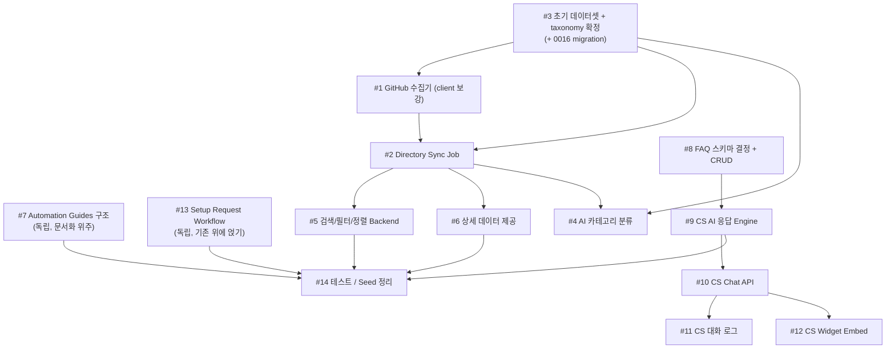

# Dev3 Implementation Guide — Directory / Data / Customer Support

> 이 문서는 코드를 대신 작성하지 않는다. 함수 시그니처, skeleton, 의사코드, SQL 구조 뼈대, 설계 선택지와 그 이유만 제공한다. 실제 로직(TODO)은 김진석(Dev3) 본인이 채운다.
>
> "현재 상태"는 2026-09-24 기준, `main` 브랜치(`git log` HEAD `75d1d42`)에서 직접 읽은 코드만 근거로 한다. 확인하지 못했거나 존재하지 않는 것은 `⚠️ 확인 필요` 또는 "없음"으로 명시한다.

---

## 1. 현재 상태 요약

### 1.1 Stack / 공통 구조

| 항목 | 확인된 사실 | 근거 파일 |
|---|---|---|
| Framework | Next.js 16.3.5, App Router, React 19.2.8, TypeScript | `package.json` |
| DB/Backend | Supabase (Postgres + Auth + RLS), **ORM 없음** | `docs/ARCHITECTURE.md`, `supabase/migrations/` |
| 검증 라이브러리 | `zod` 4.6.5 (설치돼 있음, 모든 곳에서 쓰이진 않음 — 아래 4.1 참고) | `package.json` |
| 테스트 | `vitest` 5.0.1, `npm run test` = `vitest run`, 환경 `node`, `@` alias = `src/`, `server-only`는 테스트에서 no-op으로 치환 | `vitest.config.mts` |
| Lint/Typecheck/Build | `npm run lint`(eslint), `npm run typecheck`(`next typegen && tsc --noEmit`), `npm run build` | `package.json` |
| 테스트 파일 위치 관례 | 소스 파일과 **동일 디렉터리에 co-locate** (`errors.ts`↔`errors.test.ts`, `generate.ts`↔`generate.test.ts`, `providers/providers.test.ts`) — `__tests__/` 폴더 관례 없음 | `src/server/ai/`, `src/server/shared/` |
| 미들웨어 | `src/proxy.ts` (Next.js 16 신규 convention, `middleware.ts` 아님) — `updateSession()`으로 세션 갱신만, 인가 로직은 라우트 그룹 자체 보호 방식에 의존 | `src/proxy.ts` |

**Supabase client 3분리:**

| 위치 | 용도 | RLS |
|---|---|---|
| `src/lib/supabase/client.ts` | 브라우저(Client Component) | 적용됨 |
| `src/lib/supabase/server.ts` | Server Component/Server Action, 로그인 사용자 세션 기준 | 적용됨 |
| `src/lib/supabase/admin.ts` | `createAdminClient()`, service-role key | **우회** — cron/webhook/sync 등 신뢰된 서버 코드 전용이라고 파일 주석에 명시 |

### 1.2 기존 Server Action / Route Handler 패턴

| 패턴 | 예시 파일 | 형태 |
|---|---|---|
| Server Action | `src/app/(public)/pricing/actions.ts` `createSetupRequest` | `"use server"`, `(prevState, formData) => Promise<{ error?: string; success?: boolean }>` — `useActionState` 대응 형태. `supabase.auth.getUser()`로 인증 체크 → 수동 문자열 검증 → insert → `revalidatePath` |
| Server Action (더 복잡) | `src/app/(app)/automations/actions.ts` `createAutomation` | 동일 패턴 + entitlement 체크(`canCreateAutomation`) 선행 |
| Route Handler (외부 caller) | `src/app/api/cron/run-automations/route.ts` | secret 헤더(`x-cron-secret`)로 인증, `NextResponse.json({...}, { status })` |
| Route Handler (webhook) | `src/app/api/billing/webhook/route.ts` | ⚠️ 상세 미확인 — 필요시 직접 열어볼 것 |
| Server function (읽기 전용) | `src/server/customer-support/faq.ts` `listPublishedFaqs()` | RLS-scoped client를 인자로 받아 그대로 조회 |

**⚠️ 확인된 불일치**: `createSetupRequest`/`createAutomation` 모두 `zod`를 쓰지 않고 `String(formData.get(...))` + 수동 if 체크로 검증한다. `zod`가 쓰이는 곳은 `src/lib/env/server.ts`(env 파싱), `src/types/blog-automation.ts`의 `blogSetupSchema`(폼 스키마를 도메인 타입 파일에 co-locate), `src/server/ai/generate.ts`의 `generateStructured` 제네릭 인자뿐이다. 즉 "Server Action 입력 검증에 zod를 쓴다"는 전사 통일 규칙이 아니라 **혼재**돼 있다 — Dev3 코드에서는 zod를 쓰는 쪽을 권장하되(아래 4.1), 강제 규칙처럼 서술하지 않는다.

### 1.3 마지막 migration / naming

- 마지막 파일: `supabase/migrations/0015_integration_connections.sql`. **다음 번호는 `0016`.**
- naming: `00XX_설명.sql` (스네이크케이스, 영문).
- 기존 migration은 절대 수정하지 않고, 컬럼 추가/RLS 추가도 새 migration에서 `alter table`로 한다 (예: `0008_subscriptions.sql`을 고치지 않고 `0016_...`에서 `alter table`).
- `src/types/database.types.ts`를 손으로 함께 갱신해야 한다 — codegen 스크립트 없음(README 확인).

### 1.4 공유 타입 위치

`src/types/domain.ts`가 `Database["public"]["Tables"][...]["Row"]`의 alias를 전부 모아둔다 — `DirectoryTool`, `Faq`, `SetupRequest`, `Automation`, `Business` 전부 여기 있다. 도메인별 추가 타입(zod 스키마, config shape)은 `src/types/<domain>.ts`로 분리하는 관례가 있다 (`blog-automation.ts` 사례). **Directory/Customer Support는 아직 이런 전용 타입 파일이 없다** — 새로 만들 때 `src/types/directory.ts`, `src/types/customer-support.ts` 형태를 검토.

### 1.5 티켓별 현재 상태 표

| # | 티켓 | 상태 | 근거 |
|---|---|---|---|
| 1 | GitHub AI Tool 수집기 | **일부 있음** — `fetchRepoStats()`/`parseGithubUrl()`만 존재, rate-limit/에러 분류 없음 | `src/server/directory/github.ts` |
| 2 | GitHub Directory Sync Job | **없음** — `github.ts`를 호출해 DB에 쓰는 코드 전무 | 전체 검색 결과 없음 |
| 3 | 초기 데이터셋/taxonomy | **일부 있음** — seed 3건 존재, taxonomy는 `classifier.ts`의 키워드 4종뿐, DB check constraint 없음 | `supabase/seed.sql`, `src/server/directory/classifier.ts` |
| 4 | AI 카테고리 분류 | **없음** — 키워드 매칭만, `AIProvider` 연동 없음 | `src/server/directory/classifier.ts` |
| 5 | 검색/필터/정렬 Backend | **없음** — 페이지가 `select("*").order("stars")`만 함 | `src/app/(public)/directory/page.tsx` |
| 6 | 상세 데이터 제공 | **없음** — slug 단건 조회 함수/라우트 없음, 상세 페이지 자체가 없음 | `src/app/(public)/directory/` 하위엔 `page.tsx` 하나뿐 |
| 7 | Automation Guides 구조 | **있음(고정 방식)** — DB/MDX/CMS 아님, 페이지 컴포넌트 안의 정적 TS 배열 | `src/app/(public)/guides/page.tsx` |
| 8 | Business FAQ 관리 Backend | **없음** — 읽기만 있고, `faqs`에 `business_id` 자체가 없음(전역 FAQ) | `supabase/migrations/0013_faqs.sql` |
| 9 | CS AI 응답 Engine | **없음** | 전체 검색 결과 없음 |
| 10 | CS Chat API | **없음** — public identifier 개념 전무 | 전체 검색 결과 없음 |
| 11 | CS 대화 로그 | **없음** — `support_conversations`/`support_messages` 테이블 없음 | migration 목록 확인 |
| 12 | CS Widget Embed | **없음** | 전체 검색 결과 없음 |
| 13 | Setup Request Backend | **부분 있음** — insert Server Action만 존재, 조회/status 전이/관리자 처리 전무 | `src/app/(public)/pricing/actions.ts` |
| 14 | 테스트/Seed 정리 | **디렉토리/CS 관련 테스트 0개** — `src/server/directory/`, `src/server/customer-support/`에 `*.test.ts` 없음 | 파일 목록 확인 |

### 1.6 AIProvider 사용법 (Dev1 소유, 그대로 재사용)

```ts
// src/server/ai/index.ts
export function getAIProvider(): AIProvider;      // AI_PROVIDER env로 mock/openai/gemini 선택, 프로세스당 캐시
// src/server/ai/generate.ts
export async function generateText(params: GenerateTextParams): Promise<string>;
export async function generateStructured<T>(params: GenerateStructuredParams<T>): Promise<T>;
```

- `generateStructured`는 **네이티브 JSON-schema 모드가 아니다** — 프롬프트에 "JSON만 응답하라"는 지시를 덧붙이고, 응답을 파싱해 넘겨준 `zod` 스키마로 `safeParse`한다. 실패하면 "다시 시도하라"는 문구를 붙여 **정확히 1회** 재시도하고, 그래도 실패하면 `AIProviderError("INVALID_STRUCTURED_RESPONSE", ...)`를 던진다.
- 호출부는 절대 OpenAI/Gemini SDK 타입을 몰라야 한다 — `GenerateTextParams`/`zod` 스키마만 다룬다.
- 프롬프트는 `src/server/ai/prompts/blog.ts`처럼 도메인별 `prompts/` 또는 `prompts.ts`에 `build...Prompt()` 함수로 분리하는 관례가 있다.

### 1.7 Scheduler / Cron 참고 구조 (Dev1 소유 — 직접 수정 금지, 패턴만 참고)

- `src/server/automations/scheduler.ts`: `computeNextRunAt()`(순수 함수), `findDueAutomations()`(service-role client로 "한 번의 폴링 쿼리"만 수행 — automation 1개당 job을 만들지 않음).
- 실행 주기: `supabase/migrations/0014_scheduler_cron.sql`이 `pg_cron` + `pg_net`으로 5분마다 `supabase/functions/run-due-automations`(Deno Edge Function, ~15줄)를 호출 → 그 함수가 `CRON_SECRET` 헤더를 붙여 `POST /api/cron/run-automations`를 호출 → 그 Route Handler가 실제 로직 실행.
- **Directory sync에 그대로 적용하려면 `supabase/functions/`와 새 `pg_cron` job이 필요**한데 이 경로는 Dev1 소유 영역이다 → 6장 "팀원에게 확인할 질문" 참고.

---

## 2. 권장 구현 순서

의존관계 기준. "먼저 결정 → 그다음 코드"인 항목(taxonomy, FAQ 스키마)을 앞에 배치했다.



**요약 순서**: `#7`(빠르게, 독립) → `#3 taxonomy 결정`(코드보다 먼저 팀/본인 결정) → `#1 수집기 보강` → `#2 Sync Job` → `#5 검색` → `#6 상세` → `#4 AI 분류`(선택 성격이 강한 P1) → `#8 FAQ 스키마+CRUD` → `#9 CS 응답 엔진` → `#10 Chat API` → `#11 로그` / `#12 Widget`(병렬 가능) → `#13 Setup Request`(아무 때나 끼워 넣기 가능) → `#14 테스트/Seed`(항상 마지막, 혹은 각 티켓 직후 개별적으로).

---

## 3. 티켓별 가이드

### [P0] #1 GitHub AI Tool 수집기

**목표**: `owner/repo` 하나를 주면 GitHub REST API에서 필요한 메타데이터(stars/forks/language/license/description)를 안전하게 가져오는, rate-limit과 각종 실패 케이스를 구분해서 처리하는 client.

**왜 필요한가**: 지금 `fetchRepoStats()`는 실패하면 그냥 `Error`를 던진다. Sync job이 이걸 그대로 쓰면 repo 하나가 404/private로 바뀌었을 뿐인데 전체 배치가 죽거나, 403(rate limit)을 network error처럼 취급해 불필요하게 재시도하다 토큰을 더 태울 위험이 있다.

**현재 상태**:
- `src/server/directory/github.ts` — `fetchRepoStats(owner, repo)`: `GITHUB_TOKEN` 있으면 `Authorization: Bearer`, `next.revalidate: 6h`(Next.js fetch 캐시 — **서버 사이드 fetch 캐싱**이지 우리가 원하는 "6시간마다 sync"와는 다른 개념이니 혼동 주의). `response.ok`가 아니면 `throw new Error(...)`만 함 — status code 구분 없음.
- `parseGithubUrl(url)` — 정규식으로 owner/repo 추출, 이미 구현되어 있으므로 재사용.
- rate-limit 응답 헤더(`x-ratelimit-remaining`, `x-ratelimit-reset`)를 읽는 코드 없음.
- ⚠️ 확인 필요: GitHub App/PAT의 실제 rate limit 정책은 토큰 종류에 따라 다르다 — 이 프로젝트가 어떤 토큰을 쓸지는 운영 시점에 결정.

**먼저 알아야 할 개념**:
- GitHub REST API rate limiting과 응답 헤더 — https://docs.github.com/en/rest/using-the-rest-api/rate-limits-for-the-rest-api
- Conditional requests (`ETag`/`If-None-Match`, 304 응답으로 rate limit 소모 없이 "변경 없음" 확인) — https://docs.github.com/en/rest/using-the-rest-api/best-practices-for-using-the-rest-api
- `AppError` 상속 패턴 — `src/server/shared/errors.ts`의 `ConnectorError` 구현을 그대로 참고(도메인 에러 클래스 만드는 법의 실사례).

**수정/생성할 파일 (예상)**:
- `src/server/directory/github.ts` — 기존 함수 확장(또는 에러 던지는 부분만 교체), **파일 자체를 새로 쪼갤 필요는 없어 보임**(TEAM_GUIDE 규칙 4: 과도하게 쪼개지 않기).
- `src/server/directory/errors.ts` (신규) — `DirectoryError extends AppError`.

**DB 변경 여부**: 없음.

**설계 힌트**:

```ts
// src/server/directory/errors.ts (형태 예시 — ConnectorError를 참고해 대칭적으로 설계)
export type DirectoryErrorCode =
  | "NOT_FOUND"        // 404: 삭제/이름변경된 repo
  | "PRIVATE_OR_FORBIDDEN" // 403이지만 rate-limit이 아닌 경우 (private repo 등)
  | "RATE_LIMITED"      // 403/429 + rate-limit 헤더로 확인
  | "NETWORK_FAILURE"
  | "UPSTREAM_SERVER_ERROR"; // 5xx

export class DirectoryError extends AppError {
  // TODO: ConnectorError 생성자 형태를 참고해 구성 — retryable 여부는
  // RATE_LIMITED/UPSTREAM_SERVER_ERROR/NETWORK_FAILURE만 true로.
}
```

```ts
// github.ts에 추가할 형태
export interface GithubRateLimitInfo {
  remaining: number;
  resetAt: Date; // x-ratelimit-reset(unix seconds)를 Date로 변환
}

export interface GithubRepoResult {
  stats: GithubRepoStats;
  rateLimit: GithubRateLimitInfo; // sync job이 "남은 호출 수"를 보고 조기 종료 판단할 때 사용
}

export async function fetchRepoStats(owner: string, repo: string): Promise<GithubRepoResult> {
  // TODO 1: fetch 그대로 유지
  // TODO 2: response.status로 분기 — 404 / 403(+rate-limit 헤더 유무로 RATE_LIMITED vs PRIVATE_OR_FORBIDDEN 구분) / 429 / 5xx / ok
  // TODO 3: 각 분기에서 DirectoryError를 적절한 code로 throw
  // TODO 4: 성공 시 rate-limit 헤더도 함께 파싱해 반환
}
```

**단계별 힌트**:

<details><summary>힌트 1</summary>
GitHub API는 403과 429 둘 다 "너무 많이 요청했다"는 의미로 쓸 수 있다. `response.headers.get("x-ratelimit-remaining")`이 `"0"`이면 진짜 rate limit, 그렇지 않은 403은 대개 private repo나 권한 문제다. 이 둘을 같은 코드로 묶지 말 것.
</details>

<details><summary>힌트 2</summary>
`x-ratelimit-reset`은 unix timestamp(초)다. `new Date(Number(header) * 1000)`으로 변환한 뒤, sync job에서 "지금 시각이 resetAt보다 이전이면 이번 배치는 여기서 멈춘다" 같은 조기 종료 판단에 쓸 수 있게 반환값에 포함시켜라. 이 함수 자체가 sleep/wait를 하게 만들지 말 것 — 그건 호출자(sync job)의 책임으로 남겨야 함수가 테스트하기 쉽다.
</details>

<details><summary>힌트 3 (거의 답)</summary>

```ts
const res = await fetch(url, { headers });
const remaining = Number(res.headers.get("x-ratelimit-remaining") ?? "-1");
const resetAt = new Date(Number(res.headers.get("x-ratelimit-reset") ?? "0") * 1000);

if (res.status === 404) throw new DirectoryError("NOT_FOUND", `${owner}/${repo} not found`);
if (res.status === 403 && remaining === 0) throw new DirectoryError("RATE_LIMITED", ...);
if (res.status === 403) throw new DirectoryError("PRIVATE_OR_FORBIDDEN", ...);
if (res.status === 429) throw new DirectoryError("RATE_LIMITED", ...);
if (res.status >= 500) throw new DirectoryError("UPSTREAM_SERVER_ERROR", ...);
if (!res.ok) throw new DirectoryError(/* 나머지 4xx는 어떤 코드로 묶을지 직접 결정 */);
```
</details>

**자주 하는 실수**:
- 403과 429를 구분 안 하고 둘 다 "rate limit"으로 뭉뚱그리기 (private repo 케이스를 rate limit으로 오판하면 나중에 디버깅이 힘들다).
- `fetch`의 `next.revalidate`를 "우리 sync 주기"로 착각하는 것 — 이건 Next.js의 데이터 캐시일 뿐, 직접 만드는 sync job은 이 캐시 밖에서 매번 실제로 요청한다.
- rate limit 정보를 함수 밖(sync job)으로 넘기지 않고 함수 안에서 바로 sleep 걸기 — 테스트하기 어려워지고, batch 전체 정책(몇 개 처리하다 멈출지)을 sync job이 못 정하게 된다.

**스스로 점검할 질문**:
1. 403인데 rate-limit 헤더가 없다면 무슨 상황인가? 이 케이스를 테스트로 만들 수 있는가?
2. `GITHUB_TOKEN`이 없는 상태(60req/h)에서 이 함수가 그대로 잘 동작하는가?
3. 이 함수가 "이 repo를 지금 건너뛰어야 한다"와 "전체 배치를 지금 멈춰야 한다"를 구분해서 알려주는가, 아니면 호출자가 알아서 판단해야 하는가?

**테스트 방법**: `fetch`를 mock해서 — 200(정상), 404, 403(rate-limit 헤더 0), 403(헤더 없음), 429, 500, network throw(TypeError) 각각에 대해 올바른 `DirectoryErrorCode`가 나오는지 검증. `generate.test.ts`의 `vi.mock`/`vi.hoisted` 패턴을 참고.

**완료 기준**:
- [ ] 7가지 실패 케이스(404/403+rate-limit/403 without/429/5xx/network/파싱실패)가 각각 다른 `DirectoryErrorCode`로 매핑된다.
- [ ] 성공 응답에 rate-limit 잔여량이 함께 반환된다.
- [ ] 기존 `parseGithubUrl`은 변경 없이 그대로 재사용된다.

**Dev1 / Dev2 dependency**: 없음.

---

### [P0] #2 GitHub Directory Sync Job

**목표**: curated repo 목록을 순회하며 #1의 client로 메타데이터를 가져와 `directory_tools`에 upsert하고, 실행 결과(성공/스킵/실패 개수, 마지막 성공 시각)를 로그로 남기는 배치.

**왜 필요한가**: 지금은 `directory_tools`가 seed 시점 데이터로 고정돼 있다. 사용자가 보는 stars/forks가 몇 달 전 숫자로 굳어버리면 디렉토리의 신뢰도가 떨어지고, "무료 acquisition 채널"이라는 존재 이유(AGENTS.md 1번)가 약해진다.

**현재 상태**: 완전히 없음 — `github.ts`/`classifier.ts`를 엮어서 DB에 쓰는 코드가 레포 어디에도 없다. `src/lib/supabase/admin.ts` 파일 주석에 "the directory sync job"이라는 표현이 있지만, 이는 아직 구현되지 않은 것을 가리키는 코멘트일 뿐이다(실제 코드 없음 — 문서와 실제 코드의 불일치).

**먼저 알아야 할 개념**:
- Postgres `insert ... on conflict (slug) do update` (upsert) — https://www.postgresql.org/docs/current/sql-insert.html#SQL-ON-CONFLICT . `supabase/seed.sql`에 이미 실사용 예시가 있다(그대로 참고, 수정 금지).
- Supabase JS client의 `.upsert()` — https://supabase.com/docs/reference/javascript/upsert
- 이 프로젝트의 cron 트리거 구조(1.7절) — 새 Edge Function을 또 만들지, 기존 `/api/cron/*` 계열 Route Handler 하나로 충분할지는 **Dev1과 상의 필요**(6장 참고). 우선 Route Handler 자체는 만들어 둘 수 있다(트리거 방식만 나중에 결정).

**수정/생성할 파일 (예상)**:
- `src/server/directory/sync.ts` (신규) — 핵심 로직.
- `src/app/api/cron/sync-directory/route.ts` (신규) — `api/cron/run-automations/route.ts`와 동일한 secret-header 패턴.
- (선택) `src/server/directory/curated-list.ts` 또는 DB 테이블 — #3에서 결정.

**DB 변경 여부**: #3 티켓에서 다루는 `0016` migration에 통합 가능. 이 티켓 자체는 스키마 변경이 필수는 아니다(기존 컬럼으로 충분) — 단, "이 실행이 언제 마지막으로 성공했는지" 전체 배치 단위 기록이 필요하면 별도 `directory_sync_runs` 같은 작은 로그 테이블을 고려할 수 있다(선택 사항, over-engineering 여부를 스스로 판단할 것 — TEAM_GUIDE 규칙 10: 실제 두 곳 이상 필요할 때만 추상화).

**설계 힌트**:

```ts
// src/server/directory/sync.ts
export interface SyncResult {
  processed: number;
  updated: number;
  skipped: number;
  failed: Array<{ slug: string; code: string }>; // DirectoryErrorCode 요약, 사람이 읽을 스택트레이스 전체는 로그로만
  finishedAt: Date;
}

export async function syncDirectoryTools(): Promise<SyncResult> {
  // TODO 1: curated 목록을 가져온다 (#3에서 정한 소스)
  // TODO 2: admin client 생성 (createAdminClient — 절대 RLS-scoped client 쓰지 않기)
  // TODO 3: 목록을 순회하며 fetchRepoStats 호출
  //   - RATE_LIMITED를 만나면 그 시점에서 루프를 중단하고 지금까지 결과 반환 (남은 항목은 "다음 sync"로 미룸)
  //   - NOT_FOUND/PRIVATE_OR_FORBIDDEN은 해당 repo만 INACTIVE 처리(#6과 연결) 하거나 skip하고 계속 진행
  //   - NETWORK_FAILURE/UPSTREAM_SERVER_ERROR는 해당 repo만 실패로 기록하고 계속 진행 (전체를 죽이지 않음)
  // TODO 4: 성공한 건은 upsert, last_github_sync_at 갱신
  // TODO 5: logger.info("directory_sync_finished", { ...SyncResult 요약 })
}
```

**단계별 힌트**:

<details><summary>힌트 1</summary>
"한 repo 실패 = 전체 배치 실패"가 되면 안 된다. `runner.ts`(automation)가 개별 automation 실패를 어떻게 격리하는지(`src/app/api/cron/run-automations/route.ts`의 `for...try/catch`) 그대로 참고할 수 있는 패턴이다.
</details>

<details><summary>힌트 2</summary>
rate limit만은 예외다 — 남은 요청이 0에 가까워지면 "이 repo는 실패"가 아니라 "여기서 배치를 통째로 멈추고 다음 스케줄을 기다린다"가 맞는 동작이다. #1에서 반환한 `remaining`/`resetAt`을 루프 안에서 확인해서 조기 종료(`break`) 조건으로 쓸 것.
</details>

<details><summary>힌트 3 (거의 답)</summary>

```ts
for (const repo of curatedList) {
  try {
    const { stats, rateLimit } = await fetchRepoStats(repo.owner, repo.repo);
    await admin.from("directory_tools").upsert({ slug: repo.slug, ...stats, last_github_sync_at: new Date().toISOString() }, { onConflict: "slug" });
    result.updated++;
    if (rateLimit.remaining < SOME_THRESHOLD) break; // TODO: 임계값은 직접 결정 (예: 5)
  } catch (err) {
    if (isDirectoryError(err) && err.code === "RATE_LIMITED") break;
    // TODO: NOT_FOUND -> status를 INACTIVE로 바꾸는 별도 upsert (#6과 연결)
    result.failed.push({ slug: repo.slug, code: isDirectoryError(err) ? err.code : "UNKNOWN" });
  }
}
```
</details>

**자주 하는 실수**:
- 순차 처리 대신 `Promise.all`로 전부 병렬 호출 — rate limit을 순식간에 소진하고, 실패 시 어디서 멈췄는지도 알기 어려워진다. **의도적으로 순차 처리**할 것.
- `createClient()`(RLS-scoped)로 쓰기 시도 — `directory_tools`는 insert/update RLS 정책이 아예 없으므로 반드시 `createAdminClient()`.
- sync 결과를 `console.log`로 찍기 — 이 프로젝트는 `src/lib/logger`만 쓴다(구조화 JSON).

**스스로 점검할 질문**:
1. curated 목록에 100개가 있고 50번째에서 rate limit에 걸렸다면, 나머지 50개는 언제 처리되는가? 그 설계가 맞는가?
2. 이 함수가 두 번 연속 호출돼도(cron이 중복 실행돼도) 안전한가(idempotent)?
3. 실패 로그만 보고 "지금 sync가 정상인지 비정상인지"를 판단할 수 있는가?

**테스트 방법**: `fetchRepoStats`를 mock해서 — 전부 성공 / 중간에 rate limit / 일부 404 / 일부 network error 케이스별로 `SyncResult`가 기대대로 나오는지, admin client의 `upsert`가 몇 번 호출됐는지 검증.

**완료 기준**:
- [ ] rate limit을 만나면 배치가 죽지 않고 그 시점 결과를 반환하며 멈춘다.
- [ ] 개별 repo 실패가 다른 repo 처리를 막지 않는다.
- [ ] 실행마다 `logger`로 처리/성공/실패 개수가 남는다.
- [ ] 실제로 한 번 실행해서 `directory_tools`의 `last_github_sync_at`/`stars` 등이 갱신됨을 로컬에서 확인했다.

**Dev1 / Dev2 dependency**: Dev1 — 이 배치를 어떤 주기로 어떻게 트리거할지(Vercel Cron Job 신설 vs 기존 `pg_cron`/Edge Function 인프라에 얹기)는 `supabase/functions/`를 건드릴 수도 있는 결정이라 먼저 상의.

---

### [P0] #3 AI Tool 초기 데이터셋 / 등록 방식

**목표**: "어떤 repo를 디렉토리에 넣을지"의 소스(curated 목록)와 "category는 어떤 값만 허용하는지"(taxonomy)를 코드보다 먼저 고정한다.

**왜 필요한가**: #2(sync)와 #4(AI 분류)가 이 결정에 의존한다. 나중에 바꾸면 이미 저장된 `directory_tools.category` 값을 전부 마이그레이션해야 한다.

**현재 상태**:
- curated 목록: **없음**. `supabase/seed.sql`에 3건이 하드코딩돼 있을 뿐, "다음에 추가할 repo는 어디서 관리하는가"에 대한 구조가 없다.
- taxonomy: **DB에 강제되지 않음**. `directory_tools.category`는 그냥 `text`, check constraint 없음(`0011_directory_tools.sql` 확인). 유일하게 존재하는 카테고리 목록은 `classifier.ts`의 `CATEGORY_KEYWORDS` 키 4개(`automation/framework/backend/ai-model` + fallback `other`)뿐이다.
- ⚠️ **불일치**: `AGENTS.md`(작업 지침)는 예시로 `Automation/Agent/Coding/Image/Video/Marketing/Productivity/Other`라는 다른 taxonomy를 제시한다. 실제 코드(`classifier.ts`)의 4개+other와는 다르다 — 어느 쪽을 채택할지는 **본인이 결정**해야 하는 사항이지, 이미 정해져 있는 게 아니다.

**먼저 알아야 할 개념**:
- Postgres `check` constraint로 enum-like 값 강제 — `automations.status`의 `check (status in (...))`(`0005_automations.sql`)가 이 프로젝트의 기존 관례. Postgres `enum` 타입 대신 `text + check`를 계속 써온 이유는 "새 값 추가 시 `alter type`보다 `alter table ... drop constraint / add constraint`가 migration으로 다루기 쉬워서"로 보인다(추정 — 실제 팀 논의 근거는 ⚠️ 확인 필요).

**수정/생성할 파일 (예상)**:
- `src/server/directory/taxonomy.ts` (신규) — 고정 category 목록을 **코드 상수 + 타입**으로 (zod enum 또는 `as const` 배열).
- curated 목록: 초기엔 코드 상수(`src/server/directory/curated-repos.ts`)로 시작하는 것을 권장 — DB 테이블로 만들면 "이 목록을 관리하는 CRUD UI"까지 필요해져 범위가 커진다(TEAM_GUIDE 규칙 10과 연결: 실제 필요가 생기기 전엔 단순하게).

**DB 변경 여부**: `supabase/migrations/0016_directory_tools_taxonomy.sql`(가칭)
```sql
-- 구조 뼈대 — 실제 category 목록/조건은 TODO
alter table public.directory_tools
  add column status text not null default 'ACTIVE'; -- TODO: check (status in (...)) 값 목록 결정 — 예: ACTIVE/INACTIVE
alter table public.directory_tools
  add column manual_override boolean not null default false;
-- TODO: category에도 check constraint를 걸지, 애플리케이션 레벨(zod)에서만 검증할지 결정하고 근거를 주석으로 남길 것
```

**설계 힌트**:

```ts
// src/server/directory/taxonomy.ts
export const DIRECTORY_CATEGORIES = [/* TODO: 확정한 목록, 예: "automation" | "agent" | ... */] as const;
export type DirectoryCategory = (typeof DIRECTORY_CATEGORIES)[number];
export const directoryCategorySchema = z.enum(DIRECTORY_CATEGORIES);
```

**선택지와 trade-off**:
| 선택 | 장점 | 단점 | 추천 |
|---|---|---|---|
| curated 목록 = 코드 상수 배열 | 배포=변경, git으로 리뷰/이력 추적 | repo 추가할 때마다 PR 필요 | **추천** — 3인 팀 규모에서 "새 repo 추가"는 자주 일어나는 일이 아님 |
| curated 목록 = DB 테이블 | 코드 배포 없이 추가 가능 | 관리 UI/RLS까지 필요, 지금 범위를 넘음 | 사용자가 늘어 "운영자가 자주 추가"하게 되면 그때 전환 |
| category = DB check constraint | DB 레벨에서 절대 깨지지 않음 | 값 추가할 때마다 migration 필요 | **추천** — `automations.status`와 동일한 기존 관례를 따름 |
| category = 애플리케이션(zod)만 | migration 없이 값 추가 가능 | AI가 생성한 값이나 수동 SQL로 잘못된 category가 섞여도 DB가 못 막음 | 비추천 — AGENTS.md 10번("AI가 임의 category를 생성 못하게")과 상충 |

**자주 하는 실수**:
- taxonomy를 `classifier.ts`(키워드 매칭 코드)와 `directory/taxonomy.ts`(신규) 두 곳에 따로 정의해 값이 어긋나는 것 — **하나의 소스**로 합치고 `classifier.ts`가 그걸 import해야 한다.
- curated 목록에 owner/repo만 넣고 `slug`를 즉석에서 만드는 것 — `slug`는 `directory_tools.slug unique` 제약과 직결되므로 curated 목록 자체에 slug를 명시적으로 갖고 있는 편이 안전.

**스스로 점검할 질문**:
1. 지금 seed에 있는 3개(langchain/n8n/supabase)의 category가 새 taxonomy에서 어떤 값으로 매핑되는가?
2. category 값을 하나 추가하고 싶을 때, 실제로 몇 개 파일을 고쳐야 하는가? (이상적으로는 1곳)
3. `manual_override = true`인 tool은 sync가 어떤 필드를 건드리면 안 되는가? (#2/#4와 연결해서 미리 정의해 둘 것)

**테스트 방법**: taxonomy 상수와 `classifier.ts`가 같은 값을 참조하는지(런타임에 하나의 export를 import하고 있는지) 코드 리뷰 수준에서 확인 — 별도 유닛 테스트보다는 #4의 zod 검증 테스트에서 자연히 커버됨.

**완료 기준**:
- [ ] category 허용값이 문서(코드 주석 또는 이 가이드의 후속 업데이트)에 명시돼 있다.
- [ ] curated 목록의 각 항목이 `owner`, `repo`, `slug`를 갖는다.
- [ ] `0016` migration이 기존 migration을 건드리지 않고 `alter table`만 사용한다.

**Dev1 / Dev2 dependency**: 없음.

---

### [P1] #4 AI Tool 자동 카테고리 분류

**목표**: sync로 새로 들어온(또는 category가 비어있는) tool에 대해 `AIProvider`로 category/tags/summary를 채운다.

**왜 필요한가**: 키워드 매칭은 새 카테고리의 툴(예: 이미지 생성 도구)을 계속 `other`로 떨어뜨린다. AGENTS.md 10번이 요구하는 "AI 보조 분류"가 실제로 없다.

**현재 상태**: `classifier.ts`는 순수 키워드 매칭, `AIProvider`/`generateStructured` 호출 없음.

**먼저 알아야 할 개념**:
- `generateStructured<T>({ schema })` — 1.6절 참고, 특히 "실패 시 1회 재시도 후 throw"라는 상한이 이미 provider 레벨에 있다는 점(이 함수 안에서 또 재시도 루프를 만들지 말 것).
- Prompt injection 관점에서 repo description/topics는 "외부에서 들어온 텍스트"다 —시스템 프롬프트와 분리해서 넘기는 기존 관례(`buildBlogPrompt`가 `system`/`prompt`를 분리하는 방식)를 그대로 따를 것.

**수정/생성할 파일 (예상)**:
- `src/server/directory/prompts.ts` (신규) — `buildClassifyPrompt(description, topics)`.
- `src/server/directory/classifier.ts` — AI 경로 추가. **키워드 매칭은 완전히 지우지 말고 fallback으로 남길지 결정**(아래 표).

**DB 변경 여부**: 없음(스키마는 #3에서 이미 다룸).

**설계 힌트**:

```ts
// src/server/directory/prompts.ts
export function buildClassifyPrompt(description: string, topics: string[]): { system: string; prompt: string } {
  // TODO: system에는 "너는 분류기다, 반드시 아래 목록 중 하나만 골라라" + DIRECTORY_CATEGORIES 나열
  // TODO: prompt에는 description/topics만 (신뢰하지 않는 외부 텍스트로 취급)
}

// src/server/directory/classifier.ts
const classificationResultSchema = z.object({
  category: directoryCategorySchema, // #3의 enum
  tags: z.array(z.string()).max(/* TODO */),
  shortSummary: z.string().max(/* TODO */),
});

export async function classifyWithAI(description: string, topics: string[]) {
  // TODO 1: buildClassifyPrompt 호출
  // TODO 2: generateStructured({ schema: classificationResultSchema, ... }) 호출
  // TODO 3: 실패(AIProviderError) 시 classifyCategory()(기존 키워드 함수)로 fallback할지 결정
}
```

**선택지와 trade-off — AI 실패 시 fallback**:
| 선택 | 설명 | 추천 |
|---|---|---|
| AI 실패 → 키워드 매칭 fallback | 항상 뭔가 값은 채워짐 | **추천** — sync job이 죽지 않아야 하므로, "완벽한 분류"보다 "항상 성공하는 배치"가 우선 |
| AI 실패 → category를 비워둠(null) | 나중에 사람이 수동 확인 | 운영 부담 증가, 3인 팀에서 비현실적일 수 있음 |

**manual_override와의 관계**: `manual_override = true`인 row는 sync/classify 둘 다 **category/tags/description을 덮어쓰지 않아야 한다** — `stars`/`forks`/`last_github_sync_at`처럼 "GitHub이 진실인 필드"와 "사람이 고정한 필드"를 분리해서 upsert 쿼리를 짤 것.

**단계별 힌트**:

<details><summary>힌트 1</summary>
`generateStructured`가 이미 "1회 재시도 후 실패 시 throw"를 하므로, `classifyWithAI` 안에서 또 try 루프를 돌리면 안 된다. 상위(sync job)에서 catch해서 fallback하는 흐름이 맞다.
</details>

<details><summary>힌트 2</summary>
`manual_override` 체크는 AI 호출 **이전에** 해야 한다 — 굳이 AI를 호출해놓고 결과를 버리는 건 비용 낭비다. sync job에서 `if (tool.manual_override) continue classify 단계 skip`.
</details>

<details><summary>힌트 3</summary>
upsert할 때 필드를 두 그룹으로 나눠서 생각하라: (a) GitHub sync 전용 — stars, forks, language, license, last_github_sync_at, (b) 분류 전용 — category, tags, description(요약). `manual_override`인 tool은 (b)를 upsert 대상에서 아예 제외한다.
</details>

**자주 하는 실수**:
- 분류 결과의 `category`를 zod enum이 아니라 `z.string()`으로 느슨하게 받는 것 — 이러면 AGENTS.md 10번이 요구하는 "임의 category 생성 방지"가 실질적으로 무력화된다.
- description 전체가 아니라 README 전체를 프롬프트에 넣는 것 — AGENTS.md 10번은 "필요시 README **일부**"라고 명시한다. 토큰 낭비 + 프롬프트 인젝션 표면 확대.

**스스로 점검할 질문**:
1. AI가 taxonomy에 없는 category 이름을 줬을 때(`safeParse` 실패), 그 tool은 어떤 category로 남는가?
2. `manual_override`가 정확히 어떤 컬럼들을 보호하는지 코드만 보고 알 수 있는가, 아니면 주석이 필요한가?
3. 이 함수를 mock provider(`AI_PROVIDER=mock`)로 테스트할 때 실제로 유의미한 검증이 되는가, 아니면 그냥 통과만 하는가?

**테스트 방법**: `generateStructured`를 mock해서 — 유효한 JSON/타입 안 맞는 JSON/taxonomy에 없는 category 값 세 가지 케이스로 fallback이 제대로 도는지, `manual_override=true`인 입력이 애초에 AI를 호출하지 않는지(mock 호출 횟수 0) 검증.

**완료 기준**:
- [ ] category가 항상 #3에서 정한 enum 안의 값이거나, 실패 시 명시적 fallback 값이다(임의 문자열이 저장되지 않는다).
- [ ] `manual_override=true`인 tool은 분류 결과로 덮어써지지 않는다.
- [ ] `AI_PROVIDER=mock`으로 sync 전체 플로우가 끝까지 돈다.

**Dev1 / Dev2 dependency**: 없음(AIProvider 그대로 사용).

---

### [P0] #5 Directory 검색/필터/정렬 Backend

**목표**: `directory_tools`를 keyword/category/language/tag로 필터링하고 stars/updated_at으로 정렬, pagination까지 되는 조회 함수.

**왜 필요한가**: 지금은 페이지가 전체 row를 다 가져와 정렬만 한다(`directory/page.tsx`). 데이터가 늘면 클라이언트로 수백 건이 그대로 내려간다.

**현재 상태**: `src/app/(public)/directory/page.tsx`가 `.select("*").order("stars", { ascending: false })`만 호출. 서버 함수(`src/server/directory/`)에 검색 관련 코드 없음.

**먼저 알아야 할 개념**:
- PostgREST(Supabase JS client)의 `.ilike()`, `.overlaps()`(tags 배열 검색), `.range()`(pagination) — https://supabase.com/docs/reference/javascript/select
- `ilike '%keyword%'`는 인덱스를 못 타므로(leading wildcard) 데이터가 커지면 `pg_trgm` GIN 인덱스가 필요해진다 — 지금 규모(seed 3건)에서는 필요 없지만, 설계에서 "나중에 인덱스만 추가하면 되는 형태"로 짜두는 게 좋다. https://www.postgresql.org/docs/current/pgtrgm.html
- Offset vs cursor pagination — https://supabase.com/docs/guides/database/pagination
- SQL Injection: PostgREST/Supabase client를 쓰는 한 원시 SQL 문자열 조립을 하지 않으므로 injection 표면 자체가 거의 없다 — 그래도 `q`(검색어) 길이 제한, 허용되지 않는 정렬 컬럼 화이트리스트 검증은 애플리케이션에서 직접 해야 한다(사용자가 임의 컬럼명을 `order`에 넣게 하지 않기).

**수정/생성할 파일 (예상)**:
- `src/server/directory/query.ts` (신규).
- `src/app/(public)/directory/page.tsx` — `searchParams`를 읽어 새 함수를 호출하는 최소 수정(Dev2 최종 UI는 별도).

**DB 변경 여부**: 당장은 없음. 데이터가 커지면 `create index using gin (tags)` / `pg_trgm` 추가를 별도 migration으로 — 지금 단계에서 미리 만들 필요는 없음(TEAM_GUIDE 규칙 10).

**설계 힌트**:

```ts
// src/server/directory/query.ts
export interface DirectoryQuery {
  q?: string;
  category?: string;         // #3의 DirectoryCategory로 좁힐지, 느슨한 string으로 둘지 결정
  language?: string;
  tags?: string[];
  sort?: "stars" | "updated_at"; // TODO: 화이트리스트 — 사용자가 임의 값을 못 넣게
  page?: number;
  pageSize?: number;          // TODO: 상한선 필수 (예: max 50)
}

export interface DirectoryQueryResult {
  tools: DirectoryTool[];
  total: number;
  page: number;
  pageSize: number;
}

export async function searchDirectoryTools(
  supabase: SupabaseClient<Database>, // RLS-scoped로 충분 (public read 정책이 이미 있음 — admin client 불필요)
  query: DirectoryQuery,
): Promise<DirectoryQueryResult> {
  // TODO 1: query 값들을 zod로 파싱/clamp (pageSize 상한, sort 화이트리스트)
  // TODO 2: 기본 .from("directory_tools").select("*", { count: "exact" })
  // TODO 3: q가 있으면 .ilike("name", `%${q}%`) 등 (or 조건은 .or() 문법 확인)
  // TODO 4: category/language는 .eq(), tags는 .overlaps("tags", tags)
  // TODO 5: sort/pageSize/page로 .order()/.range() 적용
  // TODO 6: #3에서 status 컬럼을 추가했다면 기본적으로 ACTIVE만 보이게 필터 (INACTIVE 제외)
}
```

**자주 하는 실수**:
- `pageSize`에 상한을 두지 않아 `pageSize=100000` 같은 요청으로 전체 테이블을 한 번에 끌어올 수 있게 두는 것.
- `sort` 파라미터를 그대로 `.order(sort)`에 넣는 것 — 화이트리스트 검증 없이 사용자 입력을 컬럼명으로 직접 쓰면, 존재하지 않는 컬럼 요청 시 에러 메시지로 스키마 정보가 노출될 수 있다.
- `status`(#3에서 추가한) 필터링을 깜빡해서 INACTIVE(삭제/비공개된 repo)가 검색 결과에 계속 노출되는 것.

**스스로 점검할 질문**:
1. `q=""`(빈 문자열)와 `q`를 아예 안 보낸 경우를 같게 처리하는가?
2. `tags` 필터에 존재하지 않는 태그를 넣으면 에러가 나는가, 빈 결과가 나오는가? 의도한 동작인가?
3. `total`(전체 개수)을 매 요청마다 `count: "exact"`로 계산하는 게 데이터가 커져도 괜찮은가, 아니면 나중에 `estimated`로 바꿔야 하는가?

**테스트 방법**: 실제 Supabase 없이 순수 로직만 테스트하기 어려운 함수이므로(쿼리 빌더 체이닝), (a) zod 파싱/clamp 부분만 순수 함수로 분리해 유닛 테스트, (b) 로컬 Supabase(또는 개발 프로젝트)에 대해 수동으로 `/directory?q=...&category=...` 조합을 눌러보며 확인.

**완료 기준**:
- [ ] keyword/category/language/tag 각각 단독으로, 그리고 조합으로 결과가 좁혀진다.
- [ ] `pageSize`에 상한이 있다.
- [ ] `sort`가 화이트리스트 밖 값이면 기본값으로 안전하게 처리된다(에러로 죽지 않는다).
- [ ] INACTIVE tool이 기본 검색 결과에서 제외된다(#3/#6과 연계).

**Dev1 / Dev2 dependency**: Dev2 — `searchParams` 계약(쿼리 파라미터 이름)을 먼저 합의.

---

### [P0] #6 AI Tool 상세 데이터 제공

**목표**: slug로 tool 단건을 조회하고, 삭제/비공개된 repo는 `INACTIVE`로 표시되게 하는 함수.

**왜 필요한가**: 지금은 목록 페이지 하나뿐이고 상세 조회 함수가 없다. 또한 repo가 삭제/비공개로 바뀌어도 이를 감지해 반영하는 경로가 없다(sync가 404를 만나도 지금은 그냥 `Error`만 던지고 끝).

**현재 상태**: 없음. `directory_tools`에 `status` 컬럼조차 없다(#3에서 추가 예정).

**먼저 알아야 할 개념**: 없음 — `.eq("slug", slug).maybeSingle()` 정도의 기본 PostgREST 사용법.

**수정/생성할 파일 (예상)**:
- `src/server/directory/query.ts`(#5와 같은 파일에 추가 가능 — 굳이 별도 파일로 쪼개지 않아도 됨) 또는 `detail.ts`로 분리할지는 파일 크기 보고 판단.

**DB 변경 여부**: #3의 `status` 컬럼에 의존. 이 티켓 자체의 추가 migration은 없음.

**설계 힌트**:

```ts
export async function getDirectoryToolBySlug(
  supabase: SupabaseClient<Database>,
  slug: string,
): Promise<DirectoryTool | null> {
  // TODO: .eq("slug", slug).maybeSingle() — INACTIVE도 상세 페이지에선 보여줄지(404 대신 "더 이상 유지되지 않음" 표시)는
  // 목록(#5)과 다른 정책일 수 있다. 직접 결정.
}

// sync job(#2)에서 NOT_FOUND/PRIVATE_OR_FORBIDDEN을 만났을 때 호출
export async function markDirectoryToolInactive(
  admin: SupabaseClient<Database>,
  slug: string,
  reason: string, // 로그용, 컬럼에 저장할지는 선택
): Promise<void> {
  // TODO: status를 'INACTIVE'로 update. description/stars 등 다른 필드는 그대로 둘지(마지막으로 알려진 값 보존) 결정.
}
```

**설계 선택지**: README 전체를 저장할지 여부 — **AGENTS.md가 명시적으로 금지**("README 전체 복제 금지"). `description`(짧은 repo 설명)과 AI가 만든 `shortSummary`(#4) 정도만 저장하고, "더 알아보기"는 항상 `github_url`로 아웃링크.

**자주 하는 실수**:
- 목록(#5)과 상세(#6)가 서로 다른 함수에서 각자 `.select("*")`를 반복 작성 — `DirectoryTool` 타입은 공유하되, 쿼리 자체의 중복은 크게 문제 없다(두 곳 다 단순 조회이므로 추상화 강요할 필요 없음, TEAM_GUIDE 규칙 10).
- `slug`가 없는(404) 경우와 `status='INACTIVE'`인 경우를 페이지에서 구분 없이 똑같이 처리 — 사용자 경험상 "그런 툴은 없음"과 "있었지만 지금은 사용 불가"는 다른 메시지가 맞다.

**스스로 점검할 질문**:
1. INACTIVE가 된 tool을 다시 GitHub sync가 발견하면(404였다가 다시 200이 되면) 자동으로 ACTIVE로 복구되는가? 그게 맞는 동작인가?
2. 상세 페이지 URL에 DB의 내부 `id`(uuid)가 아니라 `slug`가 쓰이는가? (public directory는 CS widget과 달리 uuid 노출 자체는 큰 리스크는 아니지만, 일관성 있게 slug 기반으로 가는 게 자연스럽다)

**테스트 방법**: slug 존재/미존재/`INACTIVE` 세 케이스에 대해 함수 반환값 확인. `markDirectoryToolInactive` 호출 후 `status`가 실제로 바뀌는지 확인.

**완료 기준**:
- [ ] slug로 단건 조회가 된다.
- [ ] sync job이 404/private를 만나면 해당 row가 INACTIVE로 바뀌고, 삭제되지는 않는다(이력 보존).
- [ ] README 전체 저장 코드가 없다.

**Dev1 / Dev2 dependency**: Dev2 — 상세 페이지 라우트(`/directory/[slug]`) 신설 시점 조율.

---

### [P0] #7 Automation Guides 데이터 구조

**목표**: 지금 방식(정적 TS 데이터 + `faqs` 테이블)을 유지하되, "왜 이 방식인지"와 "다음에 가이드를 추가하려면 어떻게 하는지"를 문서화한다.

**왜 필요한가**: 이 티켓은 AGENTS.md 16번("이미 프로젝트가 선택한 방식을 유지, 별도 CMS 추가 금지")을 지키는 게 핵심이다 — 새로 만들 게 사실 거의 없다.

**현재 상태**: `src/app/(public)/guides/page.tsx` 안에 `GUIDES`라는 정적 배열(제목/설명만, 본문 없음)이 하드코딩돼 있고, 그 아래 섹션은 `faqs` 테이블(`listPublishedFaqs()`)을 렌더링한다. **MDX 없음, 별도 DB 테이블 없음, CMS 없음.**

**먼저 알아야 할 개념**: 없음.

**수정/생성할 파일 (예상)**: 원칙적으로 **아무것도 안 바꿔도 되는 티켓**이다. 만약 "가이드 콘텐츠가 늘어나서 페이지 컴포넌트 안에 두기 부담스럽다"는 판단이 서면 `src/server/directory/guides-data.ts`(정적 배열을 서버 쪽 상수로 이동) 정도가 최소 변경.

**DB 변경 여부**: 없음.

**설계 힌트 / 선택지**:
| 옵션 | 언제 필요해지는가 |
|---|---|
| 지금처럼 컴포넌트 내 정적 배열 유지 | 가이드가 몇 개 안 되고 자주 안 바뀔 때 — **지금은 이걸로 충분** |
| 정적 배열을 `src/server/` 또는 `src/types/`로 이동 | 배열이 커져서 페이지 파일이 너무 길어질 때(TEAM_GUIDE 규칙 4) |
| DB 테이블로 전환 | 비개발자가 가이드를 직접 추가/수정해야 할 때 — 지금은 그런 요구 없음 |

**자주 하는 실수**: 이 티켓을 "구현할 게 없다"고 그냥 건너뛰는 것 — 문서화(이 방식을 왜 유지하는지)까지가 티켓의 완료 기준이다.

**스스로 점검할 질문**:
1. 가이드 콘텐츠(본문)가 실제로 필요해지면 그때 DB로 전환할 기준을 지금 정해둘 수 있는가?

**테스트 방법**: 해당 없음(코드 변경이 거의 없으므로).

**완료 기준**:
- [ ] 현재 방식(정적 데이터 + faqs)과 그 이유가 팀에 공유돼 있다.
- [ ] 불필요한 MDX/CMS 라이브러리를 추가하지 않았다.

**Dev1 / Dev2 dependency**: 없음.

---

### [P0] #8 Business FAQ 관리 Backend

**목표**: 사업자가 자기 FAQ를 CRUD할 수 있게 하되, 지금 전역(global) FAQ 구조를 business-scoped로 바꿀지부터 결정한다.

**왜 필요한가**: AGENTS.md 13번은 "business ownership"을 요구하는데, 실제 `faqs` 테이블에는 `business_id`가 없다. CS AI 응답 엔진(#9)이 "이 사업자의 FAQ만" 참고하려면 이 구조가 먼저 있어야 한다.

**현재 상태**:
- `faqs`(`0013_faqs.sql`): `question, answer, category, is_published`만 있음. **`business_id` 없음.**
- RLS: `is_published = true`일 때 누구나 select 가능한 정책 **1개뿐** — insert/update/delete 정책 자체가 없다(코드 주석: "관리자 개념이 생기기 전까지 service-role로만 쓴다").
- ⚠️ **중요한 설계 결정 필요**: 지금 FAQ는 `/guides` 페이지에 쓰이는 **사이트 전역 FAQ**(제품 사용법 안내)다. AGENTS.md가 말하는 "Business FAQ"(각 사업자가 자기 고객 응대용으로 등록하는 FAQ, 예: "영업시간은?")는 **다른 개념**이다. 이 둘을 같은 `faqs` 테이블에 `business_id nullable`로 합칠지, 아니면 별도 테이블(`business_faqs`)로 분리할지 먼저 결정해야 한다.

**먼저 알아야 할 개념**:
- RLS 정책 작성 — https://supabase.com/docs/guides/database/postgres/row-level-security
- `exists (select 1 from businesses where ...)` 형태로 "내가 소유한 business의 하위 row"를 검증하는 패턴 — `content_history_select_own` 정책(`0012_row_level_security.sql`)이 정확히 이 형태의 기존 예시.

**수정/생성할 파일 (예상)**:
- `src/server/customer-support/faq.ts` — `createFaq`/`updateFaq`/`deleteFaq`/`listFaqsForBusiness` 추가.
- `src/types/customer-support.ts`(신규, 선택) — FAQ 입력 zod 스키마를 `blog-automation.ts`처럼 co-locate.

**DB 변경 여부**: `supabase/migrations/0017_business_faqs.sql`(가칭, 아래는 "별도 테이블" 안을 기준으로 한 구조 뼈대 — "기존 faqs에 컬럼 추가" 안을 택하면 달라짐)

```sql
-- 두 가지 방향 중 하나를 고른 뒤 구조를 채울 것 (TODO: 아래 중 결정)
-- 방향 A: 기존 faqs에 business_id를 nullable로 추가 (null = 전역 가이드 FAQ, not null = 사업자 FAQ)
-- 방향 B: business_faqs를 별도 테이블로 신설 (전역 가이드 FAQ와 완전히 분리)

create table public.business_faqs ( -- 방향 B 예시
  id uuid primary key default gen_random_uuid(),
  business_id uuid not null references public.businesses (id) on delete cascade,
  question text not null,
  answer text not null,
  is_enabled boolean not null default true, -- AGENTS.md의 "enabled field"
  created_at timestamptz not null default timezone('utc', now()),
  updated_at timestamptz not null default timezone('utc', now())
);

alter table public.business_faqs enable row level security;

-- TODO: select/insert/update/delete 정책 — content_history_select_own 패턴처럼
-- businesses.owner_id = auth.uid() 를 서브쿼리로 확인
create policy "business_faqs_select_own" on public.business_faqs
  for select using ( /* TODO */ );
create policy "business_faqs_insert_own" on public.business_faqs
  for insert with check ( /* TODO */ );
-- update/delete도 동일 패턴
```

**설계 힌트**:

```ts
// src/server/customer-support/faq.ts (기존 listPublishedFaqs는 그대로 두고 추가)
export interface BusinessFaqInput {
  businessId: string;
  question: string;
  answer: string;
}

export async function listFaqsForBusiness(
  supabase: SupabaseClient<Database>, // RLS-scoped — 소유자 검증은 DB가 함
  businessId: string,
): Promise<BusinessFaq[]> {
  // TODO
}

export async function createBusinessFaq(
  supabase: SupabaseClient<Database>,
  input: BusinessFaqInput,
): Promise<BusinessFaq> {
  // TODO: RLS의 insert with check가 있으므로 여기서 소유권을 또 검증할 필요는 없음
  //       (단, 존재하지 않는 businessId를 넣으면 RLS가 막아주는지, FK 위반으로 막히는지 확인)
}
```

**자주 하는 실수**:
- Server Action에서 `createAdminClient()`(service-role)로 FAQ를 쓰는 것 — 그러면 RLS가 무력화돼 "내 business가 아닌 곳에 FAQ를 몰래 추가"하는 걸 애플리케이션 코드의 실수 하나로 막을 방법이 없어진다. **RLS-scoped client + 잘 짠 정책**으로 가는 게 이 티켓의 핵심.
- `is_enabled`(또는 `is_published`) 체크를 빼먹고 CS 응답 엔진(#9)에 비활성 FAQ까지 넘기는 것.

**스스로 점검할 질문**:
1. 로그인은 했지만 이 business를 소유하지 않은 사용자가 `createBusinessFaq`를 호출하면 어디서 막히는가 — RLS인가, 애플리케이션 코드인가? (RLS가 막아야 한다)
2. 전역 가이드 FAQ(`/guides`용)와 사업자 FAQ를 같은 테이블로 합쳤다면, `listPublishedFaqs()`(기존 함수)가 실수로 사업자 FAQ까지 긁어오지 않는가?

**테스트 방법**: 다른 사용자 소유 business로 insert/update/delete를 시도했을 때 RLS가 거부하는지(Supabase SQL editor에서 다른 `auth.uid()`로 직접 검증, 또는 두 개의 테스트 계정으로 수동 확인).

**완료 기준**:
- [ ] 전역 가이드 FAQ와 사업자 FAQ의 관계가 결정되고 문서화됐다.
- [ ] 사업자는 본인 business의 FAQ만 CRUD 가능(RLS로 강제).
- [ ] `is_enabled=false`인 FAQ는 CS 응답에 쓰이지 않는다.

**Dev1 / Dev2 dependency**: Dev2 — FAQ 관리 UI/폼.

---

### [P0] #9 Customer Support AI 응답 Engine

**목표**: business profile + enabled FAQ만을 컨텍스트로 질문에 답하고, 정보 밖의 사실은 만들어내지 않는 함수.

**왜 필요한가**: 이게 이 프로젝트의 CS 기능 핵심 가치다 — AGENTS.md 12번의 사우나 예시처럼, "모르면 모른다"고 답하지 못하면 신뢰를 잃는 기능이 된다.

**현재 상태**: 전무. `src/server/customer-support/`에 `faq.ts`(읽기 전용) 하나뿐.

**먼저 알아야 할 개념**:
- Grounding / "정보 밖 응답 거부" 프롬프트 설계 — 모델에게 "제공된 컨텍스트 밖 정보는 모른다고 답하라"는 지시를 **시스템 프롬프트에 명시적으로** 넣는 것이 기본이며, 그것만으로 100% 막히지 않는다는 것도 알아야 한다(모델 hallucination은 프롬프트만으로 완전히 없앨 수 없다 — 그래서 "검증"이 별도로 필요, 아래 참고).
- Context 길이 관리 — FAQ가 많아지면 전부 프롬프트에 욱여넣을 수 없다. 지금 규모(AGENTS.md 11번: "FAQ 규모가 작다면 이것으로 충분")에서는 전체를 다 넣는 것으로 시작하되, 몇 개부터 잘라내기/우선순위를 둘지 기준을 정해야 한다.
- structured output으로 "판단"까지 받아내는 패턴 — 답변 텍스트만이 아니라 `{ answer: string, isAnswerable: boolean }` 같은 필드를 함께 받아서, `isAnswerable=false`일 때는 모델이 뭐라고 썼든 애플리케이션이 정해진 안내 문구로 **강제 치환**하는 방식이 "프롬프트만 믿기"보다 안전하다.

**수정/생성할 파일 (예상)**:
- `src/server/customer-support/answer.ts` (신규).
- `src/server/customer-support/prompts.ts` (신규).

**DB 변경 여부**: 없음(#8의 산출물을 읽기만 함). 로그 저장은 #11에서 별도로 다룸.

**설계 힌트**:

```ts
// src/server/customer-support/prompts.ts
export function buildSupportAnswerPrompt(
  business: Pick<Business, "name" | "industry" | "description">,
  faqs: Pick<BusinessFaq, "question" | "answer">[],
  question: string,
): { system: string; prompt: string } {
  // TODO: system에 "아래 FAQ에 없는 내용은 모른다고 답하고, 직원 문의를 안내하라"는 원칙을
  //       AGENTS.md 12번 예시 문구를 참고해 직접 작성 (완성 문구는 이 가이드에 쓰지 않음)
  // TODO: FAQ 목록을 어떤 포맷으로 나열할지 (Q/A 페어 나열이 가장 단순)
  // TODO: business 정보 중 어디까지 컨텍스트에 넣을지 (이름/업종 정도면 충분할 수도)
}

// src/server/customer-support/answer.ts
const supportAnswerSchema = z.object({
  answer: z.string(),
  isAnswerable: z.boolean(), // FAQ 범위 안에서 답했는지 모델 스스로 표시
});

export async function answerSupportQuestion(
  business: Business,
  faqs: BusinessFaq[],
  question: string,
): Promise<{ answer: string; isAnswerable: boolean }> {
  // TODO 1: question 길이 제한 (너무 긴 입력을 그대로 프롬프트에 넣지 않기)
  // TODO 2: buildSupportAnswerPrompt + generateStructured({ schema: supportAnswerSchema })
  // TODO 3: isAnswerable === false 면 answer를 애플리케이션이 정한 고정 안내 문구로 덮어쓸지 결정
  //         (모델이 만든 문장을 그대로 믿을지, 고정 문구로 강제할지 — 후자가 더 안전)
}
```

**자주 하는 실수**:
- "모르면 모른다고 답하라"는 지시만 믿고 별도 검증 없이 모델 출력을 그대로 사용자에게 보여주는 것 — 위에서 설명한 `isAnswerable` 같은 신호 없이는 hallucination을 사후에 걸러낼 방법이 없다.
- FAQ가 하나도 없는 business에 대해 질문이 들어왔을 때를 처리 안 하는 것 — 빈 배열이면 애초에 AI를 호출하지 않고 바로 고정 안내를 반환하는 편이 비용도 아끼고 더 안전하다.
- business의 민감하지 않은 정보(이름, 업종)를 넘어 불필요한 개인정보/내부 정보까지 프롬프트에 포함시키는 것.

**스스로 점검할 질문**:
1. FAQ에 있는 질문을 살짝 다르게 표현("영업 시간이 어떻게 되나요" vs "몇 시에 여나요")해도 잘 답하는가? (`AI_PROVIDER=mock`으로는 검증 불가 — 실제 provider 필요, 로컬에서 수동 확인)
2. FAQ에 전혀 없는 질문(사우나 예시)에 실제로 거절 문구가 나오는가? 이 케이스를 테스트에 포함했는가?
3. `isAnswerable=false`인데 `answer` 필드에 모델이 그럴듯한 답을 채워 넣었다면, 그 값을 사용자에게 보여줘도 되는가, 강제로 고정 문구로 바꿔야 하는가?

**테스트 방법**: `AI_PROVIDER=mock`으로는 파싱/스키마 검증 경로만 확인 가능(실제 hallucination 방지 품질은 검증 불가) — mock provider를 커스텀 응답으로 만들어 (a) FAQ 범위 안 질문 (b) FAQ 범위 밖 질문 (c) FAQ가 비어있는 business, 세 케이스의 반환값을 확인. 실제 AI 품질 검증은 로컬에서 `AI_PROVIDER=openai`(또는 gemini)로 수동 테스트가 필요.

**완료 기준**:
- [ ] FAQ 범위 밖 질문에 사실을 지어내지 않고 정해진 형태로 거절한다.
- [ ] FAQ가 없는 business는 AI를 호출하지 않고 즉시 안내 문구를 반환한다.
- [ ] question 길이에 상한이 있다.

**Dev1 / Dev2 dependency**: 없음(AIProvider 재사용).

---

### [P0] #10 Customer Support Chat API

**목표**: 로그인하지 않은 웹사이트 방문자가 `public_widget_id` 같은 추측 불가능한 식별자로 CS 질문을 보낼 수 있는 공개 API. rate limiting과 메시지 길이 제한 포함.

**왜 필요한가**: 지금은 이 API의 인증/식별 구조가 전혀 없다. AGENTS.md 14번이 명시적으로 경고하는 "DB uuid를 그대로 public identifier로 쓰지 말 것"이 걸리는 지점이다.

**현재 상태**: 전무. `businesses` 테이블에 public widget 관련 컬럼 없음, `src/app/api/`에 CS 관련 Route Handler 없음.

**먼저 알아야 할 개념**:
- 비로그인 요청과 RLS의 관계 — RLS는 `auth.uid()`(로그인 사용자) 기준으로 동작한다. **비로그인 방문자의 요청은 RLS로 보호할 수 없다** — Route Handler 안에서 `createAdminClient()`(service-role)를 쓰되, **애플리케이션 코드가 직접** "이 widget id가 유효한가"부터 검증해야 한다는 뜻이다. `cron/run-automations`가 `x-cron-secret`으로 인증하는 것과 같은 급의 책임이 이 라우트에도 있다.
- 추측 불가능한 public identifier 생성 — DB의 `gen_random_uuid()`(uuidv4, 128bit 랜덤)를 `public_widget_id` 컬럼 값으로 그대로 써도 충분히 안전하다(순차 증가 정수 PK를 노출하는 것과는 다른 문제). "내부 PK로 쓰는 uuid"와 "public identifier로 쓰는 uuid"를 **같은 컬럼(`businesses.id`)으로 공유하지 않고 별도 컬럼**으로 두라는 게 AGENTS.md의 요지 — 이유: `id`는 다른 테이블들이 FK로 참조하며 내부적으로 계속 로그/에러에 노출되는 값이라, "이 값이 새어나가도 안전하다"는 가정을 갖고 별도로 발급하는 게 더 명확한 경계가 된다.
- Rate limiting을 **새 인프라 없이** 구현하는 방법 — Redis 같은 새 의존성을 추가하지 않는 게 이 프로젝트 제약이다. 대안: (a) Postgres 테이블에 "이 widget_id가 최근 N초 안에 몇 번 요청했는지" 카운트, (b) Vercel Edge/Next.js 자체의 IP 기반 제한(인프라 레벨, 코드로 세밀하게 못 함). 3인 팀 규모에서는 (a)가 기존 스택(Postgres)만으로 되는 현실적 선택.

**수정/생성할 파일 (예상)**:
- `src/app/api/support/[widgetId]/route.ts` (신규) — `POST`.
- `src/server/customer-support/widget.ts` (신규) — widget id 검증 + rate limit 체크.

**DB 변경 여부**: `supabase/migrations/0018_cs_widget.sql`(가칭, `0017`이 #8에서 쓰였다면 그다음 번호)

```sql
alter table public.businesses
  add column public_widget_id uuid not null default gen_random_uuid(); -- TODO: unique 제약 추가 여부 결정 (추천: unique)
-- TODO: rate limiting을 DB 카운터로 할 경우의 구조, 예:
create table public.support_widget_requests (
  id uuid primary key default gen_random_uuid(),
  business_id uuid not null references public.businesses (id) on delete cascade,
  requested_at timestamptz not null default timezone('utc', now())
  -- TODO: IP를 저장할지는 개인정보 최소화 원칙(#11)과 상충 — 저장 안 하는 방향을 우선 검토
);
create index support_widget_requests_business_id_idx
  on public.support_widget_requests (business_id, requested_at desc);
-- TODO: RLS — 이 테이블은 사람이 직접 조회할 일이 없으므로 RLS enable 후 정책 0개(=service-role 전용)로 둘지 결정
```

**설계 힌트**:

```ts
// src/server/customer-support/widget.ts
export async function getBusinessByWidgetId(
  admin: SupabaseClient<Database>,
  widgetId: string,
): Promise<Business | null> {
  // TODO: widgetId가 uuid 형식이 아니면 DB 쿼리도 하지 말고 바로 null (불필요한 쿼리 방지)
}

export async function checkRateLimit(
  admin: SupabaseClient<Database>,
  businessId: string,
): Promise<{ allowed: boolean }> {
  // TODO: support_widget_requests에서 최근 N초 이내 카운트 -> 임계값 비교
  // TODO: 허용되면 이 요청도 기록 (insert)
}
```

```ts
// src/app/api/support/[widgetId]/route.ts
export async function POST(request: Request, { params }: { params: { widgetId: string } }) {
  // TODO 1: params.widgetId로 business 조회 (없으면 404 — 존재 여부 자체를 너무 자세히 알려주지 않기)
  // TODO 2: checkRateLimit -> 초과 시 429
  // TODO 3: body의 question 길이 검증 (너무 길면 400)
  // TODO 4: listFaqsForBusiness(#8, admin client로) + answerSupportQuestion(#9) 호출
  // TODO 5: 응답은 최소한의 필드만 (answer 정도) — business 내부 정보를 그대로 흘리지 않기
}
```

**자주 하는 실수**:
- `widgetId`로 `businesses.id`(내부 PK)를 그대로 받는 것 — 이러면 이 티켓의 존재 이유가 없어진다.
- rate limit 체크를 답변 생성(AI 호출) **이후에** 하는 것 — 반드시 AI를 호출하기 **전에** 체크해야 비용 남용을 막는 의미가 있다.
- 에러 응답에 스택트레이스나 내부 에러 메시지를 그대로 노출하는 것 — 외부에 열린 API이므로 `describeAutomationRunError` 같은 "안전한 메시지로 변환" 패턴이 여기에도 필요하다.

**스스로 점검할 질문**:
1. 존재하지 않는 `widgetId`로 요청했을 때와, 존재하지만 rate limit에 걸렸을 때 응답이 서로 다른 정보를 흘리지 않는가?
2. 한 명의 악의적 사용자가 초당 수백 번 요청하면 이 rate limit 설계로 실제로 막히는가? (DB round-trip 자체가 병목이 될 수 있다는 것도 고려)
3. widget이 비활성화(business가 CS 기능을 끔)된 상태를 표현할 방법이 지금 스키마에 있는가? (없다면 #8/#9 설계에 플래그 추가를 검토)

**테스트 방법**: 잘못된 widgetId(404), 존재하는 widgetId + 정상 질문(200), rate limit 초과(429), 너무 긴 질문(400) 네 가지 케이스를 Route Handler 레벨에서 확인. `src/server/customer-support/widget.ts`의 순수 로직은 유닛 테스트로.

**완료 기준**:
- [ ] `businesses.id`가 아닌 별도 `public_widget_id`로만 접근 가능하다.
- [ ] rate limit이 AI 호출 이전에 체크된다.
- [ ] 에러 응답이 내부 구현을 노출하지 않는다.

**Dev1 / Dev2 dependency**: Dev2 — widget이 이 API를 어떤 요청/응답 형태로 부를지 계약을 먼저 합의(#12와 함께).

---

### [P1] #11 Customer Support 대화 로그

**목표**: 나중에 FAQ 품질을 개선하거나 사업자에게 "어떤 질문이 많이 들어왔는지" 보여줄 수 있도록 최소한의 대화 기록을 남기되, 개인정보를 과수집하지 않는다.

**왜 필요한가**: AGENTS.md 15번이 명시적으로 "저장 목적을 명확히 하라"고 요구한다 — 목적 없이 일단 다 저장하는 걸 경계하는 티켓이다.

**현재 상태**: 전무.

**먼저 알아야 할 개념**:
- 개인정보 최소화 원칙 — 저장 전에 "이 필드를 왜 저장하는지" 각각 답할 수 있어야 한다.
- Retention(보관 기간) — Postgres에서 오래된 row를 지우는 방법은 크게 (a) 애플리케이션/스케줄러가 주기적으로 `delete where created_at < now() - interval`을 실행, (b) `pg_cron`으로 DB 자체에서 스케줄. 이 프로젝트엔 이미 `pg_cron` extension이 활성화돼 있다(`0014_scheduler_cron.sql`)는 사실 정도만 참고 — **새 pg_cron job을 추가하는 건 Dev1 영역**이므로 직접 만들기 전에 상의.

**수정/생성할 파일 (예상)**:
- `src/server/customer-support/conversations.ts` (신규) — `#10`의 Route Handler가 호출.

**DB 변경 여부**: `0019_support_conversations.sql`(가칭)

```sql
create table public.support_conversations (
  id uuid primary key default gen_random_uuid(),
  business_id uuid not null references public.businesses (id) on delete cascade,
  question text not null,
  answer text not null,
  was_answerable boolean not null, -- #9의 isAnswerable 값
  created_at timestamptz not null default timezone('utc', now())
  -- TODO: 저장하지 않기로 한 것들을 의도적으로 여기 나열: 이메일/전화번호/IP/User-Agent 등
  --       (AGENTS.md 15번 — "필요 이상으로 수집하지 않는다"를 스키마 자체로 강제)
);

create index support_conversations_business_id_idx
  on public.support_conversations (business_id, created_at desc);

alter table public.support_conversations enable row level security;

-- TODO: select 정책 — business owner가 자기 대화 로그만 볼 수 있게 (content_history_select_own 패턴 재사용)
create policy "support_conversations_select_own" on public.support_conversations
  for select using ( /* TODO */ );
-- insert/update/delete 정책은 만들지 않는다 — Route Handler가 admin client로만 씀 (widget 요청은 비로그인이므로 RLS insert 정책 자체가 의미 없음)
```

**설계 힌트**:

```ts
export async function logSupportConversation(
  admin: SupabaseClient<Database>,
  businessId: string,
  question: string,
  answer: string,
  wasAnswerable: boolean,
): Promise<void> {
  // TODO: insert. 실패해도 사용자 응답 자체를 막지 않는 게 맞는지(로깅 실패가 CS 기능을 죽이면 안 됨) 고려해서
  //       #10 Route Handler에서 이 호출을 await 실패 시 어떻게 다룰지 결정 (예: catch해서 logger.warn만)
}
```

**자주 하는 실수**:
- 로그 저장 실패를 그대로 전파시켜 사용자에게 보여줄 답변까지 막아버리는 것 — 로그는 "있으면 좋은 것"이지 CS 기능의 필수 경로가 아니다.
- `was_answerable=false`인 대화(즉 FAQ에 없어서 놓친 질문들)를 사업자가 확인할 방법을 안 만드는 것 — 이 로그의 가장 큰 실질 가치는 "어떤 FAQ를 추가해야 하는지" 알려주는 것인데, 그 조회 기능(Dev2 UI 연동 지점)을 염두에 두고 설계할 것.

**스스로 점검할 질문**:
1. 이 테이블에 있는 각 컬럼에 대해 "왜 저장하는가"를 한 문장으로 답할 수 있는가?
2. retention 정책(예: 90일 후 삭제)을 지금 만들 것인가, 나중에 필요해지면 만들 것인가? 후자라면 그 결정을 문서에 남겼는가?

**테스트 방법**: insert 성공/실패 각각에서 `#10`의 API 응답 자체는 영향받지 않는지 확인.

**완료 기준**:
- [ ] 저장하는 필드와 저장하지 않는 필드가 명시적으로 결정/문서화됐다.
- [ ] business owner가 본인 것만 조회 가능하다(RLS).
- [ ] 로그 저장 실패가 CS 응답 자체를 막지 않는다.

**Dev1 / Dev2 dependency**: Dev1 — retention을 pg_cron으로 자동화하려면 상의. Dev2 — 사업자 대시보드에 로그를 보여줄 화면.

---

### [P1] #12 CS Widget Embed 방식

**목표**: 외부 사이트에 심을 수 있는 최소한의 embed 방식(iframe 또는 script)의 **인터페이스**를 정의한다. 실제 위젯 UI는 Dev2 담당.

**왜 필요한가**: `#10` API가 있어도 그걸 실제 사업자 웹사이트에 붙일 방법이 없으면 기능이 쓰이지 않는다.

**현재 상태**: 전무.

**먼저 알아야 할 개념**:
- iframe embed vs script embed의 trade-off — iframe은 스타일 격리가 쉽고 구현이 단순하지만 호스트 페이지와의 상호작용(예: 페이지 스크롤에 맞춘 위치 조정)이 제한적. script embed(작은 JS가 DOM에 iframe/버튼을 동적 삽입)는 유연하지만 구현 복잡도가 더 높다.
- Cross-Origin — 외부 사이트에 심기므로 CORS와 `X-Frame-Options`/CSP `frame-ancestors`를 이 경로에서 어떻게 열어줄지 고려해야 한다(iframe으로 갈 경우 `/widget/{publicId}` 라우트 자체는 어떤 사이트에서든 embed 가능해야 하므로, 이 프로젝트의 다른 페이지와 다른 보안 헤더 정책이 필요할 수 있다). ⚠️ 확인 필요 — 이 프로젝트의 보안 헤더 설정(`next.config.ts`)을 직접 열어 현재 어떤 헤더가 걸려있는지 확인한 뒤 설계할 것.

**수정/생성할 파일 (예상)**: 이 티켓은 **Dev3가 API 계약만 정의**하고, 실제 embed 페이지(`/widget/{publicId}`)와 스크립트는 Dev2 영역(`src/app/`, `src/components/`)이다. Dev3 쪽에서 준비할 것:
- `src/server/customer-support/widget.ts`(#10에서 이미 생성) — `getBusinessByWidgetId`가 embed 페이지에서도 재사용됨.
- 문서(이 가이드 또는 별도 인터페이스 문서)에 `#10` API의 request/response 형태를 명확히 남겨 Dev2가 프론트만 붙이면 되게 한다.

**DB 변경 여부**: 없음(`#10`에서 이미 `public_widget_id` 추가됨).

**설계 힌트 / 선택지**:
| 옵션 | 장점 | 단점 | 추천 |
|---|---|---|---|
| iframe (`<iframe src="https://.../widget/{publicId}">`) | 구현 단순, 스타일 격리 | 호스트 페이지와 상호작용 제한 | **추천** — MVP 단계, 3인 팀 리소스 고려 |
| script embed | 유연한 UI(플로팅 버튼 등) | 구현/유지보수 복잡도 높음 | 나중에 필요해지면 iframe 위에 얹는 방식으로 확장 가능 |

**자주 하는 실수**: 이 티켓에서 Dev2가 할 프론트 작업(버튼 디자인, 애니메이션 등)까지 손대려는 것 — Dev3 역할은 "API가 안정적으로 존재한다"까지다.

**스스로 점검할 질문**:
1. Dev2가 이 API를 처음 볼 때, request body/response body 예시만 보고 바로 연동할 수 있는가?
2. iframe으로 간다면, `/widget/{publicId}` 라우트가 다른 페이지와 다른 보안 헤더가 필요하다는 걸 Dev2에게 미리 전달했는가?

**테스트 방법**: 별도 테스트보다 API 문서(계약)의 명확성 자체가 완료 기준.

**완료 기준**:
- [ ] embed 방식(iframe/script) 중 하나가 결정됐다.
- [ ] `#10` API의 request/response 형태가 문서화돼 Dev2에게 공유됐다.

**Dev1 / Dev2 dependency**: Dev2 — 실제 embed 페이지/스크립트 구현.

---

### [P0] #13 Setup Request Backend Workflow

**목표**: 이미 있는 생성(insert) 기능 위에, 조회/상태 전이/운영자 처리 방법을 추가한다.

**왜 필요한가**: AGENTS.md 17번이 "이건 실제 lead funnel이므로 mock으로 끝내지 말라"고 명시한다. 지금은 사용자가 요청을 "보내기만" 할 수 있고, 그 이후 아무 일도 일어나지 않는다(운영자가 상태를 바꿀 방법 자체가 없다).

**현재 상태**:
- 스키마(`0010_setup_requests.sql`)는 이미 `status` check constraint(`REQUESTED/CONTACTED/IN_PROGRESS/COMPLETED/CANCELLED`)까지 완비.
- RLS: select/insert/update 본인 것만 — **delete 정책 없음**.
- Server Action: `src/app/(public)/pricing/actions.ts`의 `createSetupRequest` — **insert만** 존재. 조회(목록/상세) 함수, status 전이 액션, 어디에도 없음.
- ⚠️ **이 프로젝트 전체에 "관리자/운영자" 역할 개념이 없다** — `faqs` 테이블 주석이 이를 명시적으로 인정한다("until this project grows a real admin role concept"). 즉 지금 상태로는 REQUESTED 이후의 상태 전이(CONTACTED, IN_PROGRESS 등)를 **누가, 어떤 인증으로** 실행할지가 설계 공백이다.

**먼저 알아야 할 개념**:
- 상태 머신을 어디서 검증할지: DB `check` constraint는 "허용된 값 목록"만 강제하지, "REQUESTED에서 COMPLETED로 바로 못 간다" 같은 **전이 규칙**은 강제하지 못한다(Postgres도 트리거로 가능은 하지만 이 프로젝트는 트리거를 `set_updated_at`류의 단순 용도로만 쓰는 관례 — 복잡한 상태 전이 트리거는 기존 패턴과 안 맞는다). 전이 규칙은 **애플리케이션 코드**에서 검증하는 게 이 프로젝트 스타일과 맞다.

**수정/생성할 파일 (예상)**:
- `src/app/(public)/pricing/actions.ts` — 기존 `createSetupRequest`는 유지, **읽기/상태변경은 이 파일에 더할지, `src/server/customer-support/setup-requests.ts`(신규)로 서버 함수를 분리하고 `actions.ts`는 얇은 wrapper로 둘지 결정**(TEAM_GUIDE 규칙 4/9 — 파일이 너무 커지면 분리).
- `src/server/customer-support/setup-requests.ts`(신규 권장) — 목록/전이 로직.

**DB 변경 여부**: 스키마 자체는 이미 충분 — 변경 불필요. (운영자 인증 방식을 어떻게든 만들게 되면 그때 별도 검토.)

**설계 힌트**:

```ts
// src/server/customer-support/setup-requests.ts
const STATUS_TRANSITIONS: Record<SetupRequestStatus, SetupRequestStatus[]> = {
  REQUESTED: ["CONTACTED", "CANCELLED"],
  CONTACTED: ["IN_PROGRESS", "CANCELLED"],
  IN_PROGRESS: ["COMPLETED", "CANCELLED"],
  COMPLETED: [],
  CANCELLED: [],
  // TODO: 이 전이 규칙이 실제 운영 프로세스와 맞는지 직접 검증 (예: CONTACTED에서 REQUESTED로 되돌리는 게 필요할 수도)
};

export function canTransition(from: SetupRequestStatus, to: SetupRequestStatus): boolean {
  // TODO: STATUS_TRANSITIONS 조회
}

export async function listMySetupRequests(
  supabase: SupabaseClient<Database>, // RLS-scoped
): Promise<SetupRequest[]> {
  // TODO: select own (RLS가 이미 필터링해주므로 추가 조건 불필요)
}

export async function updateSetupRequestStatus(
  supabase: SupabaseClient<Database>, // 사용자 본인 취소는 RLS-scoped로 충분
  id: string,
  to: SetupRequestStatus,
): Promise<void> {
  // TODO: 현재 status를 조회 -> canTransition 확인 -> update
  //       사용자가 직접 할 수 있는 전이는 사실상 "REQUESTED/CONTACTED -> CANCELLED" 정도뿐일 것
  //       (CONTACTED/IN_PROGRESS/COMPLETED로의 전이는 운영자만 해야 함 — 아래 "관리 방법" 참고)
}
```

**관리자 처리 방법 — 선택지와 trade-off**:
| 옵션 | 설명 | 장점 | 단점 |
|---|---|---|---|
| Supabase Studio에서 직접 row 수정 | 코드 없음, admin client도 필요 없음 | 즉시 가능, 3인 팀 규모에 가장 현실적 | UI 없음, 실수로 잘못된 값 입력 가능(그래도 check constraint가 막아줌) |
| 최소 스크립트(service-role, CLI) | `npm run` 스크립트로 status 변경 | 버전관리됨, 재사용 가능 | 여전히 로컬 실행 필요 |
| `is_staff` 개념 도입 후 관리 페이지 | 제대로 된 운영 UI | 이 프로젝트에 없는 "역할" 개념을 새로 도입 — 범위가 커짐(Dev1/Dev2와 조율 필요) | 지금 범위를 벗어남 |

**추천**: 지금 규모(3인 팀, MVP)에서는 **Supabase Studio 직접 수정**으로 시작하고, "관리자 역할"은 실제 setup request가 쌓이기 시작하면 별도 프로젝트로 논의하는 걸 권장 — AGENTS.md 자체도 "mock으로 끝내지 말라"고 했지 "지금 당장 완전한 admin 시스템을 만들라"고 하지는 않았다는 점을 근거로 삼을 수 있다.

**자주 하는 실수**:
- 사용자가 자기 setup_request의 status를 `COMPLETED`로 직접 바꿀 수 있게 열어두는 것 — RLS의 `update own` 정책은 "본인 것"만 검증하지 "어떤 값으로 바꿀 수 있는지"는 검증하지 않으므로, `canTransition`으로 애플리케이션이 막아야 한다(사용자에게 허용되는 전이는 취소 정도로 제한).
- 목록 조회에 pagination 없이 전부 가져오는 것 — 개인 사용자 기준으로는 지금 규모에서 큰 문제는 아니지만 습관적으로 `.limit()`을 고려.

**스스로 점검할 질문**:
1. 사용자가 자신의 `REQUESTED` 요청을 `COMPLETED`로 직접 바꾸려 하면 막히는가? 어디서 막히는가(RLS? 애플리케이션?)?
2. 운영자가 오늘 새로 들어온 setup request를 확인하려면 지금 설계상 무엇을 해야 하는가? 그 방법이 현실적인가?

**테스트 방법**: `canTransition`은 순수 함수이므로 모든 (from, to) 조합에 대해 유닛 테스트하기 쉽다 — 허용/불허 조합을 표로 만들어 전부 검증.

**완료 기준**:
- [ ] 사용자가 본인 요청 목록을 조회할 수 있다.
- [ ] 사용자가 임의 상태로 전이를 시도해도 허용된 전이만 통과한다.
- [ ] 운영자가 상태를 바꾸는 방법이 (비록 수동이더라도) 문서화돼 있다.

**Dev1 / Dev2 dependency**: Dev2 — "내 요청 목록" 페이지.

---

### [P1] #14 Directory/CS 테스트 및 Seed 정리

**목표**: 위 티켓들에서 만든 순수 로직(파싱/검증/필터/fallback)에 유닛 테스트를 붙이고, `lint`/`typecheck`/`test`/`build`가 전부 통과하는 상태를 만든다.

**왜 필요한가**: 지금 `src/server/directory/`, `src/server/customer-support/`에는 테스트가 하나도 없다. `docs/README.md`가 설명하는 CI(`ci.yml`)가 `main` push 시 lint→typecheck→test→build→docker build를 돈다 — 여기서 처음 걸리면 뒤늦게 발견된다.

**현재 상태**: 두 디렉토리 모두 `*.test.ts` 0개.

**먼저 알아야 할 개념**:
- 이 프로젝트의 vitest 관례(1.1절): co-located, `vi.mock`/`vi.hoisted`로 모듈 mock, `environment: "node"`, `server-only`는 테스트에서 no-op.
- `vitest.config.mts`의 `env` 블록 — `NEXT_PUBLIC_SUPABASE_URL` 등 placeholder가 이미 세팅돼 있는 이유: admin client 생성 코드를 import하는 모듈이 있으면 env 검증이 import 시점에 실행되기 때문. 새로 만드는 서버 코드가 이 플레이스홀더로 충분히 동작하는지(즉, 실제 네트워크 호출 없이 함수 자체는 import 가능한지) 확인할 것.

**수정/생성할 파일 (예상)**:
- 위 각 티켓에서 만든 파일 옆에 `*.test.ts` — 예: `src/server/directory/github.test.ts`, `src/server/directory/query.test.ts`, `src/server/directory/classifier.test.ts`, `src/server/customer-support/answer.test.ts`, `src/server/customer-support/setup-requests.test.ts` 등.
- **Seed 분리**: 기존 `supabase/seed.sql`은 수정하지 않는 게 원칙(다른 팀원도 참조 중일 수 있음 — 이 규칙은 "기존 migration/seed를 고치지 말라"는 절대 규칙 0번과 별개로, seed.sql은 migration이 아니라 언제든 다시 실행 가능한 데이터이므로 실제로는 추가/확장이 자연스럽다). curated 목록(#3)이나 새 테이블(#8/#11)의 seed 데이터가 필요하면 **새 seed 파일**(예: `supabase/seed_dev3.sql`) 또는 기존 `seed.sql`에 새 `insert ... on conflict`) 문을 추가하는 방향을 README의 "적용 방법"과 함께 고려 — 이 부분은 실제 구현 시점에 팀과 상의해 결정할 것(이 문서가 강제하지 않음).

**설계 힌트 — 테스트 우선순위**:
| 우선순위 | 대상 | 이유 |
|---|---|---|
| 높음 | `#1` github.ts 에러 분류, `#3` taxonomy/zod 검증, `#4` classify fallback, `#13` canTransition | 순수 함수 + 분기가 많아 회귀에 취약 |
| 중간 | `#9` answerSupportQuestion (mock 기반 스키마 검증까지만) | 실제 품질은 테스트로 못 잡지만 회귀 방지는 됨 |
| 낮음 | `#5`/`#6` 쿼리 빌더 (체이닝 위주) | 실제 DB 없이는 얕은 검증만 가능 — 로컬 수동 확인으로 보완 |

**자주 하는 실수**: 테스트를 "커버리지 채우기"로 접근해 의미 없는 happy-path 하나만 작성하는 것 — 이 도메인은 특히 **실패/경계 케이스**(rate limit, hallucination, RLS 위반)가 핵심 가치이므로 그쪽에 테스트를 집중할 것.

**스스로 점검할 질문**:
1. `npm run typecheck`/`npm run lint`/`npm run test`/`npm run build`를 로컬에서 전부 돌려봤는가?
2. 새로 만든 테스트가 실패하게 만들어본 적이 있는가(일부러 로직을 깨뜨려서 테스트가 실제로 잡아내는지 확인)?

**테스트 방법**: 위 자체가 테스트 티켓이므로 — "테스트를 어떻게 테스트하는가"는 CI(`ci.yml`)가 최종 검증자.

**완료 기준**:
- [ ] `src/server/directory/`, `src/server/customer-support/`의 핵심 분기 로직에 테스트가 있다.
- [ ] `npm run lint && npm run typecheck && npm run test && npm run build`가 로컬에서 전부 통과한다.
- [ ] seed 데이터 추가 방식이 팀과 합의됐다(README 갱신 필요 여부 포함).

**Dev1 / Dev2 dependency**: 없음.

---

## 4. 공통 규칙

- **입력 검증**: 이 프로젝트는 zod가 설치돼 있지만 모든 Server Action이 쓰고 있진 않다(1.2절). Dev3 신규 코드는 **zod로 통일**하는 걸 권장 — `src/types/blog-automation.ts`의 `blogSetupSchema`처럼 도메인 타입 파일에 co-locate.
- **에러 응답 형식**: Server Action은 `{ error?: string; success?: boolean }` 형태의 상태 객체를 반환(throw하지 않음). Route Handler는 `NextResponse.json({ ... }, { status })`. 도메인 내부 함수는 `AppError` 상속 클래스를 throw하고, 호출부(Action/Route Handler)에서 사람이 읽을 메시지로 변환.
- **server-only 경계**: 서버 전용 파일 최상단에 `import "server-only";`를 빠짐없이 넣는다(`github.ts`, `faq.ts` 등 기존 파일 전부 이 관례를 따름).
- **migration/RLS 작성 규칙**: 기존 파일 수정 금지, `00XX_설명.sql`로 신규 추가(다음 번호는 `0016`), 새 테이블은 반드시 `alter table ... enable row level security` + 최소 select 정책부터. 쓰기 정책이 없으면 service-role 전용이라는 뜻 — 의도적인지 확인하고 넘어갈 것.
- **공유 type 위치**: `Database["public"]["Tables"]` alias는 `src/types/domain.ts`에 추가(새 테이블 생기면 여기부터). 도메인 전용 스키마/config 타입은 `src/types/<domain>.ts` 신설 검토.
- **로깅**: `src/lib/logger`의 `info/warn/error`만 — `console.*` 금지.

## 5. 리스크 & 보안 체크리스트

- [ ] GitHub rate limit — 403 vs 429 구분, `x-ratelimit-remaining` 기준 조기 종료가 sync job에 있는가.
- [ ] Duplicate data — `directory_tools.slug` unique 제약에 의존한 upsert(`on conflict`)가 실제로 쓰이는가, 순수 insert로 중복 row가 생기지 않는가.
- [ ] RLS 누락 — 새로 만드는 모든 테이블에 `enable row level security` + 최소 select 정책이 있는가. 쓰기 정책이 없다면 "service-role 전용"이 의도한 설계인지 코드 리뷰에서 확인.
- [ ] AI hallucination — CS 응답이 FAQ 범위를 벗어난 사실을 만들어내지 않는지, `isAnswerable=false` 케이스가 실제로 테스트됐는지.
- [ ] Public API abuse — `public_widget_id`가 `businesses.id`와 별도 컬럼인지, rate limiting이 AI 호출 이전에 걸리는지.
- [ ] service-role key 노출 — `createAdminClient()`가 Route Handler/서버 함수 밖(Client Component, 응답 body 등)으로 새어나가지 않는지.
- [ ] 개인정보 과수집 — `support_conversations`에 이메일/전화/IP를 저장하고 있지 않은지.
- [ ] schema overlap — `customer-support` automation 템플릿(Dev1, `src/server/automations/handlers/customer-support.ts`, "주기적 FAQ 초안 생성")과 이 가이드의 CS AI 응답 엔진(실시간 질문 응답)을 같은 기능으로 착각해 Dev1 파일을 건드리지 않는지.

## 6. 팀원에게 확인할 질문

**Dev1에게**:
1. Directory Sync Job(#2)을 어떤 방식으로 스케줄링할까 — 기존 `pg_cron`/Edge Function 인프라(`supabase/functions/`)에 새 job을 추가하는 걸 원하는지, 아니면 Dev3가 별도로(예: Vercel Cron Job) 독립적으로 구성해도 되는지.
2. Setup Request 운영자 처리(#13)에서 "역할/권한" 개념이 이 프로젝트에 도입될 계획이 있는지(billing/entitlements 쪽에 비슷한 필요가 이미 있는지).
3. `src/server/automations/handlers/customer-support.ts`(주기적 FAQ 초안 생성 automation)를 이번 CS AI 응답 엔진(#9)과 훗날 연결할 계획이 있는지, 아니면 완전히 별개로 둘지.

**Dev2에게**:
1. Directory 검색/필터(#5) UI가 어떤 쿼리 파라미터 이름/형태를 기대하는지(예: `?q=`, `?category=`).
2. FAQ 관리(#8), Setup Request 목록(#13) 대시보드 페이지를 언제쯤 붙일 계획인지 — Server Action/함수 시그니처를 그에 맞출 수 있도록.
3. CS Widget(#12)을 iframe/script 중 어느 쪽으로 원하는지, 위젯 디자인 요구사항이 API 응답 필드에 영향을 주는지(예: 추천 질문 목록 같은 부가 정보 필요 여부).

## 7. 참고 자료

- GitHub REST API rate limiting: https://docs.github.com/en/rest/using-the-rest-api/rate-limits-for-the-rest-api
- GitHub REST API best practices (conditional requests 포함): https://docs.github.com/en/rest/using-the-rest-api/best-practices-for-using-the-rest-api
- Supabase Row Level Security: https://supabase.com/docs/guides/database/postgres/row-level-security
- Supabase JS client (select/upsert/pagination): https://supabase.com/docs/reference/javascript/select , https://supabase.com/docs/reference/javascript/upsert
- Supabase Pagination 가이드: https://supabase.com/docs/guides/database/pagination
- Postgres `ON CONFLICT` (upsert): https://www.postgresql.org/docs/current/sql-insert.html#SQL-ON-CONFLICT
- Postgres `pg_trgm` (텍스트 검색 인덱스, 필요해지면): https://www.postgresql.org/docs/current/pgtrgm.html
- Next.js Route Handlers: `node_modules/next/dist/docs/`(AGENTS.md 지침대로 이 저장소에 고정된 버전 문서를 우선 참고 — 웹 문서와 API가 다를 수 있음)
- Zod: https://zod.dev/
- Vitest: https://vitest.dev/